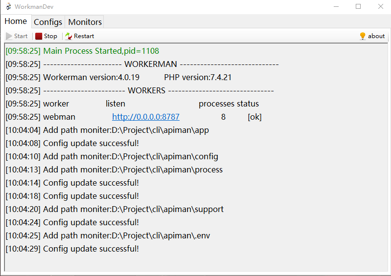

# WorkermanDev[beta]

##### A Workerman  launcher under windows， suitable for programs written in the Workerman framework, which can automatically restart the process when the program code changes, making development more efficient.

## Functions

- Gui interface, simple and convenient
- Configurable file and folder monitoring
- Configurable file extension filter
- Delay and merge file changes to avoid frequent restart of the process
- Single file, no installation required
- MIT agreement

------

##### 一个windows下的workerman程序启动器，适用于 Workerman 框架编写的程序，可以在程序代码变更时自动重启进程，让开发更高效。

功能列表

- Gui 界面，简洁便捷
- 可以设定文件及文件夹监视
- 可以设定文件扩展名过滤器
- 延迟和合并处理文件变更，避免频繁重启进程
- 单文件，无需安装。
- MIT 协议
